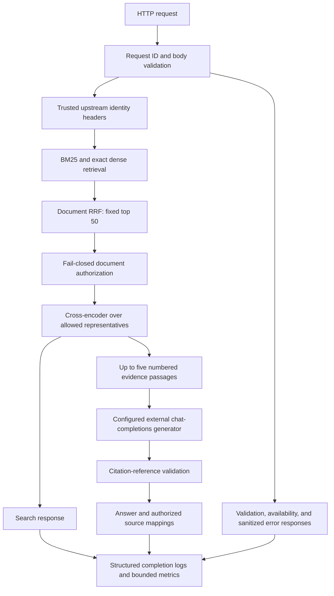

# Current architecture

## Request flow

One FastAPI lifespan retains the corpus, chunks, BM25/dense indexes, encoder, cross-encoder, immutable policy snapshot, optional HTTP generator, and preparation time. A shared lock serializes search/ask inference. `/health` reads flags only; `/metrics` copies process-local counters under a separate short lock. Every HTTP path has request-ID observation; neither operational endpoint performs inference.

## Retrieval and evidence

SciFact loading/checksums are separate from ranking. Documents have stable parent IDs; deterministic 180-word/30-overlap chunks preserve readable text. BM25 uses case-folded alphanumeric tokens. Revision-pinned all-MiniLM-L6-v2 supplies cached, normalized 384-dimensional embeddings; exact dot products equal cosine similarity. Hybrid deduplicates parents, combines 100 unique documents per component with equal-weight RRF k=60, and retains their existing representative passages.

The API filters the fixed hybrid top 50 through `AuthorizedIndex` before the pinned ms-marco-MiniLM cross-encoder sees protected text. Reranking deduplicates representatives by chunk ID, takes each parent's maximum raw score, and returns winning passages without extra fetching. `/search` returns up to k authorized documents. `/ask` sends up to five winners to unchanged M6 numbered context/grounding prompt and the independent standard-library HTTP generator; inline reference validation checks source membership, not truth or entailment.

## Authorization and observation

A principal consists of tenant, ID, and groups. Tenant equality is mandatory, followed by tenant-wide visibility OR an explicit principal OR an allowed group. Missing entries deny access; malformed/missing policy configuration disables protected routes. The five-document/two-tenant JSON overlay is synthetic deployment metadata, not SciFact annotation. Policies load once from `AUTHORIZATION_POLICY_PATH` and require restart to change. Trusted identity headers do not authenticate direct clients.

`RequestTracingMiddleware` uses a ContextVar across async tasks/handler threads, canonical UUIDv4 IDs, monotonic handling durations, sanitized errors, and payload-free JSON logs. `Metrics` tracks bounded route/status counters and duration summaries under one lock; the delegating generation observer detects actual call failures. Raw Uvicorn URL access logs are suppressed. Counters are non-durable, reset on restart, and independent across processes.

## Deployment and scientific paths

Docker packages locked runtime dependencies with the application in a non-root Linux amd64 image and one Uvicorn worker. Read-only corpus, encoder, reranker, and policy mounts protect host artifacts; the dense cache parent stays writable. Host Ollama is external. Offline flags prevent model fetching at startup. The deployment requires prepared host assets; an image build does not verify mounts, readiness, or generator connectivity.

The privileged CLI prepares/downloads assets and runs unscoped scientific searches/evaluations. Frozen retrieval reports compare 300 test queries; separate M7 claim verification classifies only 188 explicitly stance-annotated claims with its fixed prompt/schema, sequential requests, runtime gate, and fingerprinted atomic checkpoints. Its structured citation array differs from normal ask's inline markers. Neither benchmark changes API tenant behavior or proves general answer correctness.

CI installs dependencies, runs offline fixture tests, builds packages, checks whitespace, and builds the image without starting it. No database, identity provider, vector service, external telemetry stack, or cloud deployment is implemented. See [data flow](DATA_FLOW.md), [file walkthrough](CODE_WALKTHROUGH.md), [runbook](RUNBOOK.md), and [result provenance](../results/README.md).
